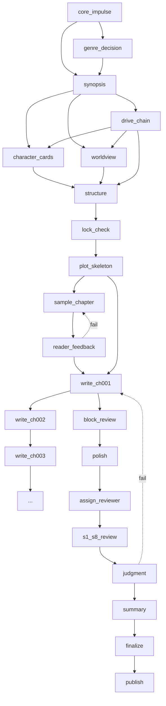
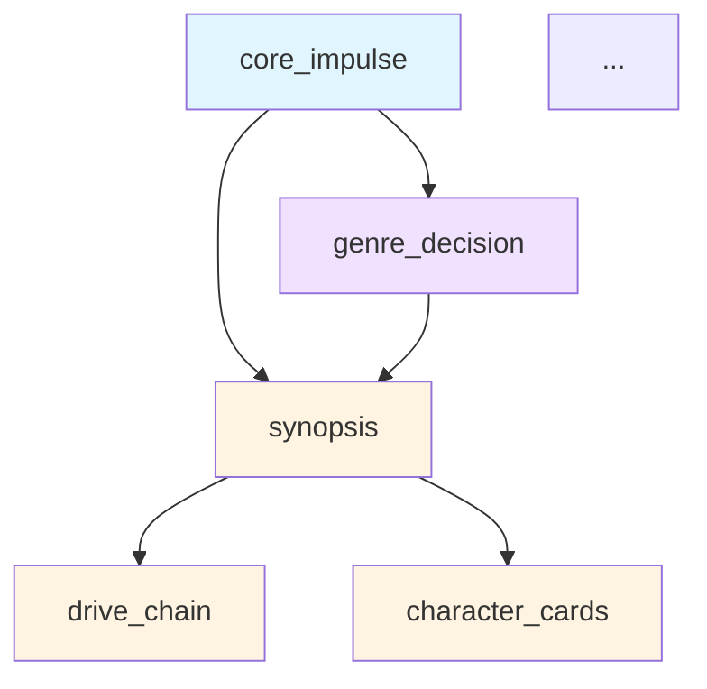

# GoT (Graph of Thoughts) 适配设计 v1.0

> 日期：2026-06-03
> 状态：待批准
> 配套：Doc 1 (理论框架) / Doc 2 (提示词工程) / Doc 3 (支线)
> 输入：用户 29 条想法 #29, #8, #11

---

## 一、为什么需要 GoT

当前痛点：

1. **22 步线性**：工作流是固定流水线，不能"分叉后再合并"
2. **重做成本高**：某一步失败要回滚整条
3. **决策不可见**：人在哪里决策、看什么、看多少，没显式模型
4. **并行困难**：理论上 STEP_12-15 可并行，但实际串行
5. **优化困难**：不知道哪一步是瓶颈

**用户原话 (#29)**：基于 GoT 的理论重构整个项目流程。

**GoT (Graph of Thoughts)** [Yao et al. 2023] 把思维过程建模为有向图：
- **节点 (Thought)**：决策/产物
- **边 (Dependency)**：数据依赖
- **路径 (Path)**：从输入到输出的轨迹

**目标**：把灵文从"22 步流水线"升级为"思维图"，支持分叉/合并/并行/回溯。

## 二、核心命题

**小说创作 = 在思维图上的一次前向 + 回溯搜索。**

- 节点 = 一次"思考/决策/生成"
- 边 = "我需要你的输出"
- 主路径 = 当前正在走的路径
- 回溯 = 检测器发现问题, 回到上游节点重做

## 三、GoT 数据模型

### 3.1 核心类型

```python
class NodeType(str, Enum):
    INPUT = "input"              # 用户输入/灵感
    ANALYSIS = "analysis"        # 分析/研究
    SYNTHESIS = "synthesis"      # 综合/设计
    GENERATION = "generation"    # 生成 (LLM 写)
    EVALUATION = "evaluation"    # 评估 (检测器)
    DECISION = "decision"        # 决策 (人/自动)
    AGGREGATION = "aggregation"  # 聚合 (合并多个输出)
    OUTPUT = "output"            # 最终输出

class NodeStatus(str, Enum):
    PENDING = "pending"
    READY = "ready"              # 所有入边完成
    RUNNING = "running"
    COMPLETED = "completed"
    FAILED = "failed"
    SKIPPED = "skipped"
    STALE = "stale"              # 下游节点已用, 重新生成

@dataclass
class ThoughtNode:
    node_id: str                          # "outline_design" / "ch001_review"
    type: NodeType
    name: str
    description: str

    inputs: list[str]                     # 依赖的 node_ids
    outputs: list[str]                    # 提供的 node_ids

    prompt_scenario: Optional[str]         # 关联到 Doc 2 的场景
    output_schema: Optional[type]          # 输出结构

    depends_on: list[str] = field(default_factory=list)  # 强依赖
    parallel_with: list[str] = field(default_factory=list)  # 可并行
    conflicts_with: list[str] = field(default_factory=list)  # 互斥

    token_budget: int = 0
    timeout_s: int = 60

@dataclass
class NodeExecution:
    node_id: str
    status: NodeStatus
    started_at: datetime
    finished_at: Optional[datetime]
    output: Optional[Any]
    error: Optional[str]
    attempt: int = 1
    cost_tokens: int = 0
```

### 3.2 图结构

```python
class ThoughtGraph:
    nodes: dict[str, ThoughtNode]
    executions: dict[str, list[NodeExecution]]  # 历史执行

    def ready_nodes(self) -> list[str]:
        """所有入边 COMPLETED, 可以执行的节点"""
        ...

    def topological_paths(self, start: str, end: str) -> list[list[str]]:
        """从 start 到 end 的所有路径"""
        ...

    def parallel_batches(self) -> list[list[str]]:
        """可并行的节点批次"""
        ...

    def backtrack_to(self, node_id: str) -> set[str]:
        """回溯到 node_id, 标记下游为 STALE"""
        ...
```

## 四、22 步到 GoT 节点的映射

### 4.1 节点化重构

原 22 步是线性 PHASE_0→7，每步可拆为 1+ 个 GoT 节点：

| 原 STEP | GoT 节点 | 类型 | 依赖 |
|---------|---------|------|------|
| STEP_01 核心冲动 | `core_impulse` | SYNTHESIS | (input) |
| STEP_02 类型 | `genre_decision` | DECISION | `core_impulse` |
| STEP_03 梗概 | `synopsis` | GENERATION | `core_impulse, genre_decision` |
| STEP_04 驱动链 | `drive_chain` | GENERATION | `synopsis` |
| STEP_05 人物 | `character_cards` | GENERATION | `synopsis, drive_chain` |
| STEP_06 世界观 | `worldview` | GENERATION | `synopsis, drive_chain, character_cards` |
| STEP_07 结构 | `structure` | GENERATION | `worldview, character_cards, drive_chain` |
| STEP_08 锁定门 | `lock_check` | EVALUATION | `structure` |
| STEP_09 情节骨架 | `plot_skeleton` | GENERATION | `structure` |
| STEP_10 核心样章 | `sample_chapter` | GENERATION | `plot_skeleton, character_cards` |
| STEP_11 目标读者 | `reader_feedback` | EVALUATION | `sample_chapter` |
| STEP_12 批量写作 (1) | `write_chapter` × N | GENERATION | `plot_skeleton, snapshot, prev_chapter` |
| STEP_13 批次完成 | `batch_complete` | AGGREGATION | `write_chapter[]` |
| STEP_14 Block | `block_review` | EVALUATION | `write_chapter` |
| STEP_15 Polish | `polish` | GENERATION | `block_review` |
| STEP_16 分配审核员 | `assign_reviewer` | DECISION | `polish` |
| STEP_17 S1-S8 | `s1_s8_review` | EVALUATION | `polish` |
| STEP_18 审核判定 | `judgment` | DECISION | `s1_s8_review` |
| STEP_19 汇总整理 | `summary` | AGGREGATION | `judgment[]` |
| STEP_20 卷/阶段定稿 | `finalize` | AGGREGATION | `summary` |
| STEP_21 发布归档 | `publish` | OUTPUT | `finalize` |

### 4.2 边 (依赖关系) 示意



### 4.3 与现有 22 步的关系

**不破坏**现有 22 步的语义，**新增** GoT 抽象层：

```
lingwen.py run workflow     --> GoT runtime
  step 1 (CORE_IMPULSE)     --> thought node core_impulse
  step 2 (GENRE)            --> thought node genre_decision
  ...
```

- 22 步保留为**人话描述**
- GoT 是**执行机制**
- 状态机记录在 `.state/thought_graph.db`

## 五、关键能力

### 5.1 分叉 (Branching)

**场景**：写 ch005 时, 想试 2 种风格 (作家 A 燃向 / 作家 B 慢热)。

```python
graph.create_branch(
    fork_node="write_ch005",
    branches=[
        {"name": "burning", "writer": "writer_a"},
        {"name": "slow_burn", "writer": "writer_b"},
    ]
)
# 两条分支都执行, 然后由 judgment 节点选 1
```

**用途**：A/B 测试, 多种创意尝试

### 5.2 合并 (Aggregation)

**场景**：3 个审核员分别审核, 取最严意见。

```python
class JudgmentAggregator:
    """多审核员意见合并器"""
    def aggregate(self, reviews: list[QualityReport]) -> QualityReport:
        # 合并 P0/P1/P2, 取最严
        ...
```

### 5.3 并行 (Parallelism)

**场景**：写 5 章同时进行, 每章独立。

```python
parallel_batch = graph.parallel_batches()
# [['write_ch001', 'write_ch002', 'write_ch003'], ...]
```

**实现**：用 asyncio + 独立 LLM 调用

### 5.4 回溯 (Backtracking)

**场景**：s1_s8_review 失败, 回到 polish 节点。

```python
graph.backtrack_to("polish")
# 下游节点 (assign_reviewer, s1_s8_review, judgment, ...) 全部 STALE
# polish 节点重做
```

**回溯深度限制**：
- 软回溯 ≤ 2 次 (走捷径)
- 硬回溯 ≤ 3 次 (强制人工介入)

### 5.5 缓存 (Memoization)

**场景**：写 ch001-005 失败了, 重做 ch006 时, plot_skeleton 不用重算。

```python
class ThoughtCache:
    """节点输出缓存 (按 inputs hash)"""
    def get_or_compute(self, node, inputs_hash, compute_fn):
        ...
```

## 六、GoT 执行器

### 6.1 整体流程

```
[User triggers "run workflow"]
        ↓
[Load graph definition from yaml]
        ↓
[Initialize ThoughtGraph with all nodes PENDING]
        ↓
[Loop]
    Find ready_nodes (入边 COMPLETED, 状态 READY)
    Execute in parallel (asyncio.gather)
    Update status (RUNNING → COMPLETED/FAILED)
    On FAILED:
        Backtrack strategy:
        - 软回溯: 标记 STALE, 重做
        - 硬回溯: 标记 ABORT, 报人
        On COMPLETED:
            Cache output
            Find newly ready nodes
        ↓
[Until no PENDING or all FAILED or terminal]
        ↓
[Return final outputs]
```

### 6.2 调度器

```python
class GoTScheduler:
    def __init__(self, graph: ThoughtGraph, cache: ThoughtCache, llm: LLMClient):
        self.graph = graph
        self.cache = cache
        self.llm = llm

    async def run(self, start_nodes: list[str], max_steps: int = 100):
        for step in range(max_steps):
            ready = self.graph.ready_nodes()
            if not ready:
                break
            await asyncio.gather(*[self._run_node(n) for n in ready])

    async def _run_node(self, node_id: str):
        node = self.graph.nodes[node_id]
        inputs = {dep: self.graph.executions[dep][-1].output
                  for dep in node.depends_on}
        inputs_hash = self.cache.hash_inputs(inputs)

        cached = self.cache.get(node_id, inputs_hash)
        if cached:
            return cached

        result = await self.llm.execute(node.prompt_scenario, inputs)
        self.cache.put(node_id, inputs_hash, result)
        self.graph.record_execution(node_id, result)

    def visualize(self) -> str:
        """导出 mermaid"""
        ...
```

## 七、配置文件

```yaml
# workflows/novel_writing.yaml
graph:
  name: "novel_writing"
  version: "1.0"

  nodes:
    - id: core_impulse
      type: synthesis
      scenario: core_impulse_extraction
      depends_on: []
      budget: 8000

    - id: genre_decision
      type: decision
      scenario: genre_decision
      depends_on: [core_impulse]
      budget: 4000

    - id: synopsis
      type: generation
      scenario: synopsis_generation
      depends_on: [core_impulse, genre_decision]
      budget: 16000

    # ... 其他节点

    - id: write_ch005
      type: generation
      scenario: chapter_writing
      depends_on: [plot_skeleton, snapshot, prev_chapter]
      budget: 8000
      parallel_with: [write_ch006, write_ch007]

  # 回溯策略
  backtrack:
    max_soft: 2
    max_hard: 3
    on_p0_failure: hard   # P0 失败必须硬回溯
    on_p1_failure: soft   # P1 失败软回溯
```

## 八、与现有模块映射

| 现有 | 在 GoT 中 |
|------|----------|
| `lingwen.py run workflow` | 替换为 `lingwen.py got run novel_writing` |
| `infra/state/workflow_validator.py` | 演化为 GoT 调度器 |
| `infra/state/state_manager.py` | 演化为 `ThoughtCache` |
| `infra/agent_system/master_controller.py` | 演化为 GoTScheduler |
| 22 步工作流 (CLAUDE.md) | 保留为**人话层**, 底层是 GoT |
| `infra/.state/workflow.db` | 演化为 `thought_graph.db` |

## 九、可视化 (mermaid)

调度器内置 mermaid 导出：

```bash
lingwen.py got visualize novel_writing --output graph.mmd
```

输出文件：



## 十、与四类决策点的整合

现有"大决策确认"机制(CLAUDE.md 第 322-368 行)在 GoT 中实现为 `decision` 类型节点：

| 决策点 | GoT 节点 | 类型 | 触发者 |
|--------|---------|------|--------|
| 大纲审核 | `outline_judgment` | decision | 人类 |
| 卷/阶段审核 | `volume_judgment` | decision | 人类 |
| 正文审核迭代 | `chapter_iteration_judgment` | decision | 人类 |
| 发布决策 | `publish_judgment` | decision | 人类 |
| 重大变更 | `change_approval` | decision | 人类 |
| 支线开/关 (Doc 3) | `subplot_open/close` | decision | 人类/自动 |
| 风格选 A/B | `style_pick` | decision | 人类/自动 |

**自动 vs 人类**：低风险自动决策, 高风险 (P0/支线开/角色死) 推人类 (用户 #17)。

## 十一、实施路径

### Phase 0 (本文) ✅

### Phase 1: 基础 (2 周)
- 实现 `ThoughtNode` / `NodeExecution` / `ThoughtGraph`
- 实现 `ThoughtCache` (SQLite 后端)
- 实现 `GoTScheduler` 基础版
- TDD: 拓扑排序, ready_nodes, 并行, 回溯

### Phase 2: 配置化 (1 周)
- workflows/ YAML 格式
- 加载器
- 22 步 → GoT 节点映射 (一个 workflow 文件)

### Phase 3: 与 master_controller 整合 (2 周)
- GoT 调度替换现有 22 步
- 状态机迁移 (兼容旧 workflow.db)
- 回退方案: GoT 不可用时退到 22 步

### Phase 4: 可视化 + 决策面板 (1 周)
- mermaid 导出
- HumanDecisionQueue (用户 #17)
- Web dashboard 展示图状态

## 十二、风险与缓解

| 风险 | 缓解 |
|------|------|
| GoT 调度比 22 步慢 | 节点级缓存 + 并行 |
| 回溯循环 | max_soft/hard 限制 + 强制人工 |
| 配置爆炸 | 强制 single source of truth: workflows/*.yaml |
| 状态机迁移风险 | 双轨运行 1 个月 |
| 调度器复杂度 | 先跑通单线, 后启用分叉/合并 |

## 十三、与其他文档关系

- **Doc 1 理论框架**：ThoughtNode.output = WorldSnapshot
- **Doc 2 提示词工程**：ThoughtNode.prompt_scenario → 模板库
- **Doc 3 支线模型**：plot 节点 = ThoughtNode 子图, Ripple = 边
- **CLAUDE.md 22 步**：保留为"用户视角", 底层是 GoT
