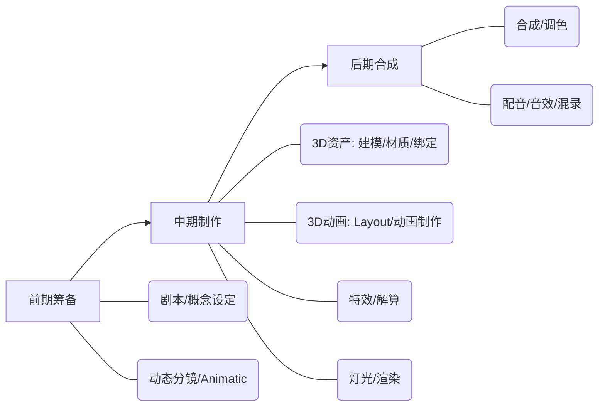

动画制作与真人电影最大的区别在于：**真人电影是“捕捉现实”，而动画是“无中生有”**。
在真人电影里，你搭好景、架好机器，演员一走位，画面就有了；但在动画里，风吹过头发的一丝飘动、桌角的一杯咖啡，都需要人工一点点创造出来。因此，动画制作的**工业管线更加严苛，前期筹备的重要性被无限放大**——因为改一张草图只要几分钟，而改一个渲染好的3D模型可能要几天。
目前业界主流的动画分为**2D动画**和**3D动画**（定格动画相对小众），两者中期流程差异较大。下面以最复杂、最规范的**3D动画电影流程**为主线进行拆解，并在关键节点补充2D的区别：
---
### 全局流程图览

---
### 第一阶段：前期筹备——定生死的地基
在动画里，前期没想清楚就开工，等于烧钱。这阶段的核心是**把文字完全转化为视听蓝图**。
#### 1. 剧本与世界观
*   **做什么**：和真人电影一样需要剧本，但动画剧本必须强调**视觉想象力**。同时，由于动画的角色和世界观从零开始，需要大量的“设定”。
*   **概念设定**：角色设计（三视图、表情、配色）、场景设计、道具设计、气氛图。这决定了整部片子的美术风格。
#### 2. 分镜头脚本
*   **做什么**：将剧本画成连续的草图，标明景别、运镜、角色走位和台词。
*   **2D与3D的区别**：2D动画的分镜几乎就是最终画面的骨架；3D动画的分镜在之后还会经历一次“3D化重塑”。
#### 3. 动态分镜—— **最核心的环节！**
*   **做什么**：把静态分镜剪接在一起，**加上粗略的配音、音效和初步的时间节奏**。这相当于用最简陋的素材先“拍”一版电影。
*   **为什么重要**：动画的每一秒都是钱。通过动态分镜，导演可以在不花大钱做动画之前，把节奏、时长、镜头逻辑全部敲定。**一旦动态分镜锁定，中期就严格按此执行，绝不轻易修改。**
#### 4. 先期配音
*   **做什么**：动画通常是**先录音，后画嘴型**（真人电影是后期配音）。演员的情感和节奏会直接指导动画师的创作。
---
### 第二阶段：中期制作——肝与肉的锻造
这是3D动画最庞大、最耗时的管线阶段，各部门如同流水线般紧密咬合。
#### 1. 资产制作——造物
*   **建模**：把2D设定图变成3D立体模型（白模）。
*   **材质贴图**：给白模上色、添加质感（皮肤的毛孔、衣服的布料纹理、金属的锈迹）。
*   **绑定**：**极其关键的一步！** 给模型装上虚拟的“骨骼”和“控制器”。绑定好不好，直接决定动画师能让角色摆出多生动的姿势。
> *2D动画区别：2D动画此阶段是“原画与中间画”，由原画师画出关键帧，补间动画师补全过渡动作。*
#### 2. Layout（3D布局/3D分镜）
*   **做什么**：把做好的3D资产放进虚拟场景，用虚拟摄影机摆位，确定人物走位和镜头运动。
*   **意义**：这是对前期2D分镜的3D化升级，确定了最终画面的空间关系。
#### 3. 动画制作——赋予灵魂
*   **Blocking（ Blocking/关键姿势）**：动画师先摆出角色的关键动作姿势，只看姿势是否准确、叙事是否清晰，此时动作是跳跃的。
*   **Polishing（精修/补间）**：在关键姿势之间补全过渡帧，调整运动曲线，加入挤压拉伸、次要动作（如头发飘动、衣服摆动），让动作丝滑流畅。
*   **面部动画**：精细调整面部表情和口型同步。
#### 4. 特效与解算——物理法则
*   **解算**：计算衣服的褶皱随动作如何变化、头发的飘动（非常吃算力）。
*   **特效**：水、火、烟雾、爆炸、魔法光效等。特效师通常不手动做，而是通过物理参数让软件自动计算生成。
#### 5. 灯光与渲染——光影魔术
*   **灯光**：像真人电影的灯光师一样，在3D软件里打主光、辅光、轮廓光、环境光，营造氛围，引导观众视线。
*   **渲染**：计算机根据模型、材质、灯光计算生成最终的2D图像序列。**这是极其耗时的步骤**（一帧画面可能渲染几小时甚至几天）。
---
### 第三阶段：后期合成——最终的打磨
#### 1. 合成
*   **做什么**：渲染出来的画面通常是分层的（比如背景一层、角色一层、特效一层），合成师将它们叠加在一起，进行最后的微调（加景深、加光晕、校色、擦除穿帮）。
#### 2. 剪辑与声音
*   **剪辑**：动画在前期动态分镜时已经剪过一轮，这里的剪辑主要是将最终渲染的画面替换进去，做微调。
*   **音效与配乐**：加入环境音、拟音、原创配乐。
*   **混录**：平衡台词、音效和音乐的音量与空间感，输出最终声画合一的成片。
---
### 💡 新手/独立创作者的避坑指南
1. **永远不要跳过动态分镜！**
   新手最常犯的错是：有个点子，画了几个角色，就开始一帧一帧做动画。结果做了一半发现节奏不对、镜头穿帮，推翻重来的成本巨大。**动态分镜是你试错成本最低的地方。**
2. **不要在动作上死磕，先抓姿势**
   无论是2D还是3D，做动画时，先让关键姿势有表现力。姿势如果不好看、没讲清楚故事，动作再流畅也是废片。
3. **警惕“恐怖谷”**
   如果你没有顶级的绑定和渲染能力，尽量避开写实风格。风格化、卡通化的动画（如皮克斯、索尼风格）不仅容错率更高，也更容易做出讨喜的效果。
4. **声音是动画的半条命**
   即使画面很简陋，只要声音（配音、音效、BGM）节奏踩得准，观众就会觉得“很有动感”。先铺声音，再做动画，事半功倍。
5. **3D不是万能的，选择适合的工具**
   *   想做叙事短片、画风自由：2D软件或手绘更出效果。
   *   想做运镜炫酷、机械/特效多：3D软件更合适。
   *   如果是新手一个人做，考虑2.5D（3D渲染成2D风格，如《宝石之国》或各种虚拟主播短片），是目前性价比最高的独立制作路线。
动画是一个需要极度耐心和匠心的工作。如果你有具体的制作方向（比如想用Blender做个3D短片，或者用TVPaint画2D），可以告诉我，我能给你更针对性的流程建议！
