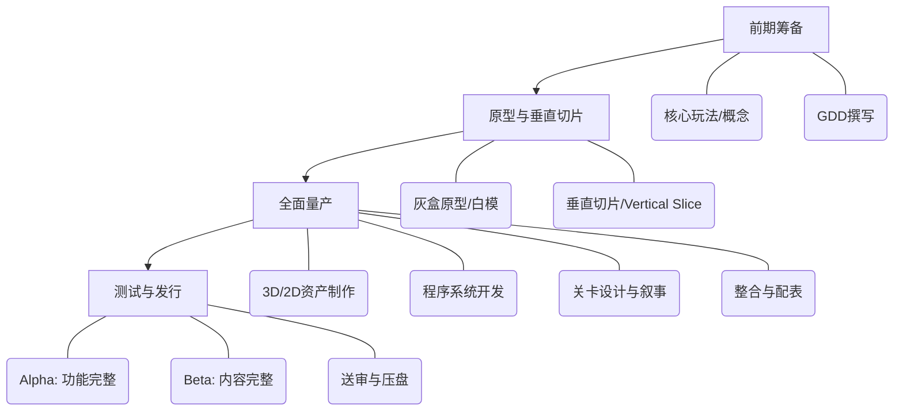

游戏制作与电影、动画最大的区别在于一个核心词：**互动性**。
电影和动画是“线性”的，观众只是旁观者；而游戏是“非线性”的软件，玩家是参与者。因此，游戏制作的本质是**“设计体验 + 软件工程”**。这也决定了它的流程比影视更强调**迭代**和**试错**。
目前业界主流的游戏制作流程，通常分为四个大阶段：**前期筹备 → 原型与垂直切片 → 全面量产 → 测试与发行**。
---
### 全局流程图览

---
### 第一阶段：前期筹备——回答“这游戏好玩吗？”
这个阶段不是在写剧情，而是在寻找**核心玩法**。
#### 1. 核心概念与循环
*   **做什么**：确定游戏的类型（RPG、FPS、肉鸽？）、目标受众、核心卖点。
*   **核心循环**：这是游戏的灵魂。玩家在游戏里每分每秒在干什么？
    *   *比如《暗黑破坏神》：打怪 → 掉装备 → 角色变强 → 打更强的怪。*
*   **方法建议**：用一句话说清你的游戏。“这是一个……的游戏”。
#### 2. GDD撰写
*   **做什么**：游戏设计文档。包含系统设计、数值框架、关卡规划、美术需求等。
*   **避坑**：新手最爱写几十万字的GDD，但这毫无意义。GDD是活的，会随开发不断修改，**初期GDD只写核心系统，别写细节**。
---
### 第二阶段：原型与垂直切片——验证“真的好玩吗？”
这是游戏开发最生死攸关的阶段。很多项目死就死在“觉得好玩，做出来无聊”。
#### 1. 灰盒原型
*   **做什么**：用最简陋的美术资源（方块、圆柱体），甚至纸面原型，把核心玩法做出来。
*   **核心目的**：**试玩！** 如果一个只有白方块的游戏不好玩，加上顶级美术它依然不好玩。在这个阶段验证手感、节奏、数值体验。
#### 2. 垂直切片
*   **做什么**：把游戏的一个完整片段（比如一个关卡、一个Boss战），做到**最终发售的质量**。包含最终的美术、音效、UI、程序逻辑。
*   **核心目的**：
    *   给老板/投资人看，要钱要人。
    *   跑通所有制作管线，确定“这样做能出效果”，避免量产后返工。
---
### 第三阶段：全面量产——流水线作业
垂直切片通过后，团队开始扩充，进入最枯燥但也最庞大的量产期。
#### 1. 美术资产制作
*   **做什么**：角色建模/原画、场景、UI、特效、动画。
*   **管线逻辑**：原画设定 → 3D建模/绑定 → 动画制作 → 导入引擎 → 引擎内调材质/打光。
*   **重点**：游戏资产极度受限于性能（面数、贴图大小、同屏Draw Call），美术不仅要好看，还要“优化”。
#### 2. 程序系统开发
*   **做什么**：把GDD里的规则变成代码。核心系统（移动、战斗）、AI系统、UI逻辑、网络同步、工具链开发。
*   **重点**：程序很大一部分工作是在给策划和美术**做工具**（如关卡编辑器、配表工具），工具越好，量产越快。
#### 3. 关卡设计与内容填充
*   **做什么**：策划用程序提供的工具和美术提供的资产，开始“搭积木”。摆放怪物、设计地形、编写剧情事件。
*   **重点**：关卡设计是心流设计，什么时候紧、什么时候松、什么时候给奖励，需要反复调试。
#### 4. 整合与配表
*   **做什么**：策划通过修改Excel表格（配表）来调整数值（怪物血量、武器伤害），程序读取表格生成游戏逻辑。不需要改代码就能调平衡。
---
### 第四阶段：测试与发行——修罗场
游戏界有一句名言：“最后10%的工作要花90%的时间”。
#### 1. Alpha阶段（功能完整）
*   **状态**：所有系统开发完毕，可以从头玩到尾，但Bug满天飞，数值极不平衡。
*   **任务**：不再增加新功能（**锁功能**），开始集中修Bug。
#### 2. Beta阶段（内容完整）
*   **状态**：美术资产全部入库，优化完毕，游戏体验接近发售版。
*   **任务**：疯狂测Bug、调数值、做本地化（翻译多国语言）。
#### 3. 送审与压盘
*   **做什么**：提交给平台方（索尼、微软、苹果、Steam等）审核，通过后生成最终发售版本。
---
### 💡 新手/独立开发者避坑指南（血泪经验）
1. **警惕“范围蔓延”**
   这是独立游戏死亡的头号原因。一开始想做个小体量RPG，做着做着想加坐骑，加锻造，加多结局……最后做不完烂尾。**把游戏做小，把它做完，比什么都重要。**
2. **不要一上来就搞开放世界**
   开放世界对系统架构、关卡设计、性能优化的要求是指数级上升的。新手请从线性或箱庭关卡做起。
3. **核心玩法先行，剧情美术后置**
   很多新手先写几十万字的剧本，画一堆设定图，结果发现根本没法做成游戏玩法。**先让游戏“能玩”，再让它“好看/有故事”。**
4. **尽早让陌生人试玩**
   你的游戏只有你懂怎么玩，但玩家不懂。尽早找不认识的人试玩，闭上嘴，只看他们卡在哪里、哪里觉得无聊。玩家的行为比他们的意见更真实。
5. **善用现成引擎和资产**
   除非你是为了学习底层技术，否则请直接用Unity或Unreal Engine。前期原型甚至可以用商城里的免费资产替代，别在初期把时间花在捏一个普通木箱子上。
游戏开发是一场马拉松，需要极强的抗压能力和跨部门沟通能力。如果你有想做的具体游戏类型（比如2D像素肉鸽，或者3D解谜），我可以帮你梳理更针对性的开发步骤和推荐工具！
