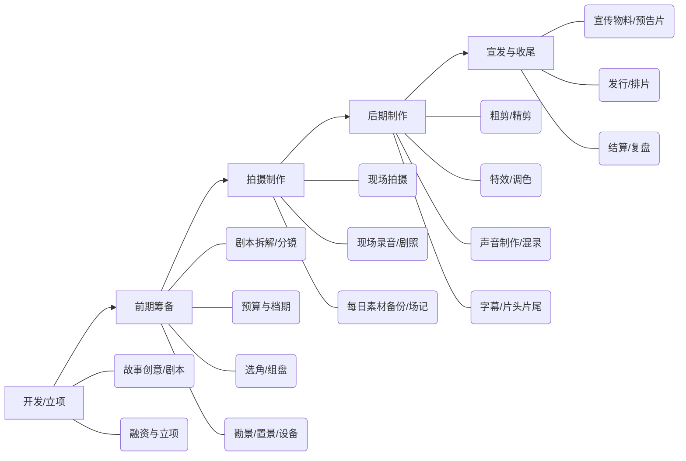

先给你一个总览：  
业内一般把电影制作分成**五大阶段**：开发 → 前期筹备 → 拍摄 → 后期制作 → 宣发与收尾。每个阶段的核心任务和工作方法差异很大，但彼此紧密咬合。
---
## 一、总览：电影制作的全局流程
用一张结构图先把整体看清楚：

下面按阶段拆开讲，重点讲“做什么”和“怎么做”。
---
## 二、阶段 1：开发 / 立项——把“点子”变成“项目”
核心目标：**把一个模糊的灵感，变成一个可投资、可执行的剧本+项目计划。**
### 1. 故事创意与剧本开发
- 做什么：  
  - 确定题材类型、主题、一句话故事（你之前写剧本的方法这里直接用上）。  
  - 完成从故事梗概 → 分场大纲 → 完整剧本的多轮修改。
- 方法建议：
  - 先写“故事梗概+人物小传”，再往下细化分场，不要一上来就写完整台词。
  - 反问自己：这个故事**值得花大钱拍**吗？观众为什么要买票？
### 2. 立项与融资
- 做什么：  
  - 确定制片人、导演、出品方等核心主创。  
  - 制作项目书（故事梗概、主创阵容、预算区间、目标受众）。  
  - 向投资方/平台/公司路演，争取投资或立项审批。
- 方法建议：
  - 预算不要只粗略一个总数，最好按“制作费+宣发费+备用金”拆分，更显专业。
  - 同时确认版权归属、收益分配，避免后面扯皮。
### 3. 审查与合规（尤其国内）
- 做什么：  
  - 完成故事大纲/剧本备案，取得拍摄许可（如国内需广电备案/过审）。
- 方法建议：
  - 提前了解题材禁忌，不要写到一半才发现“过不了审”。
---
## 三、阶段 2：前期筹备——把“剧本”变成“可执行的拍摄计划”
核心目标：**让所有人、钱、设备、场地、时间都对齐，开拍时不再临时抱佛脚。**
### 1. 剧本拆解与分镜
- 做什么：  
  - 剧本拆解：按场景、人物、道具、服装、特效等拆分，列出“元素清单”。  
  - 分镜头脚本/镜头清单：把每个场景拆成镜头，标明景别、运动、时长等。
- 方法建议：
  - 拆解越细，拍摄日越不容易混乱。  
  - 分镜可以是手绘、照片参考或文字分镜，关键是**导演+摄影+美术达成共识**。
### 2. 预算与档期规划
- 做什么：  
  - 根据拆解结果，制作详细预算（演员、场地、设备、美术、后期、保险等）。  
  - 制定拍摄档期和顺序：按场景/演员档期/光线条件排拍摄日程。
- 方法建议：
  - 排档期时，把**同场景、同演员的戏集中拍**，节省转场和候场成本。
  - 预算一定要留 10%–20% 的备用金，用于超支和意外。
### 3. 组建团队
- 做什么：  
  - 核心主创：导演、摄影、美术、录音、剪辑等。  
  - 执行团队：1st 副导演、制片主任、灯光、场务、化妆、服装、道具等。
- 方法建议：
  - 1st 副导演是现场“总调度”，负责盯进度和流程，非常关键。
  - 团队要明确汇报关系：谁听谁的，避免现场多头指挥。
### 4. 选角与演员准备
- 做什么：  
  - 试镜、确定演员；签合约、排档期。  
  - 剧本围读、排练，对台词和走位。
- 方法建议：
  - 给演员足够时间准备，不要临开拍才把剧本给人家。
  - 提前排练关键重场戏，减少现场 NG 次数。
### 5. 勘景、置景与设备准备
- 做什么：  
  - 实地勘景：确认场地是否可拍、光线、噪音、电力、许可等。  
  - 置景/搭景：根据美术设计布景、做陈设。  
  - 设备：摄影机、镜头、灯光、录音设备、发电车等，提前测试。
- 方法建议：
  - 勘景时多拍照片和视频，回来和分镜对照，避免现场“和想的不一样”。
  - 设备做“开机前测试”，不要到现场才发现机器有故障。
---
## 四、阶段 3：拍摄制作——现场执行，把计划变成素材
核心目标：**在有限时间内，拍足质量够用的画面和声音。**
### 1. 现场拍摄流程（每一天）
典型的一天工作流大致是：
1. 提前到场：布光、置景、设备调试。  
2. 副导演召集演员走位、排戏。  
3. 摄影机、录音确认无问题。  
4. 场记板打板：标明场次/镜号/条数，便于后期对位。  
5. 导演喊“Action”，演员表演；一条拍完导演确认是否“过”。  
6. 场记记录：每条是否可用、导演备注、技术问题等。  
7. 素材当天备份、整理，避免数据丢失。
### 2. 现场控制与协作
- 导演：把控表演、镜头和节奏，决定是否通过。  
- 摄影：执行构图、运动、光影，保证画面质量。  
- 录音：确保对白清晰、环境声可控。  
- 美术/化妆/服装：保证画面里一切“穿帮”细节不出戏。  
- 1st 副导演：盯进度，协调各部门，解决突发状况。
方法建议：
- 尽量按计划推进，但也要允许现场适度调整，不要死板到一条好戏都不让多试两条。  
- 控制现场噪音和围观人群，尤其是外景，声音出问题后期很难救。
---
## 五、阶段 4：后期制作——把“素材”变成“电影”
核心目标：**通过剪辑、声音、特效和调色，形成最终成片。**
### 1. 粗剪与精剪
- 做什么：  
  - 粗剪：按剧本顺序把素材拼起来，看整体节奏和结构是否有问题。  
  - 精剪：在粗剪基础上调整节奏、镜头顺序，强化情感和叙事。
- 方法建议：
  - 先解决“故事讲得清不清”，再追求“剪得帅不帅”。  
  - 多做版本对比：节奏快一点/慢一点，选择情绪最对的那一版。
### 2. 视觉特效与调色
- 做什么：  
  - 特效：CGI、擦除威亚、绿幕合成等。  
  - 调色：统一色调，营造氛围，强化视觉风格。
- 方法建议：
  - 特效尽早介入，不要剪完才发现很多镜头“救不了”。  
  - 调色前先确定整体色调风格（暖色/冷色、高饱和/低饱和），避免整片色彩不统一。
### 3. 声音制作与混录
- 做什么：  
  - 对白清理、补录（ADR）、拟音、音效设计。  
  - 配乐创作或选曲。  
  - 混录：把对白、音效、音乐混成一条平衡的声带。
- 方法建议：
  - 同期声能用的尽量用，后期补录要演员配合，成本高且不易自然。  
  - 混录时注意：台词永远听不清是致命问题，音乐和音效不能盖过人声。
### 4. 字幕、片头片尾与最终输出
- 做什么：  
  - 字幕翻译、字幕时间轴对齐。  
  - 片头片尾（主创名单、公司 logo、版权信息等）。  
  - 输出不同格式：DCP（影院）、网络文件等。
- 方法建议：
  - 片尾名单很容易出错，要逐个核对，不要漏人、错字。  
  - 输出前要做全片播放检查，音画同步、字幕无乱码。
---
## 六、阶段 5：宣发与收尾——让电影被观众看到，并把钱算清楚
核心目标：**把电影卖出去，把钱收回来，并为下一次项目积累经验。**
### 1. 宣传与营销
- 做什么：  
  - 制作预告片、海报、剧照、EPK（制作特辑）。  
  - 媒体采访、首映礼、路演、社交媒体运营等。
- 方法建议：
  - 预告片不要把高潮全剪进去，留点悬念。  
  - 宣传点要和影片类型匹配：文艺片讲情绪，商业片讲场面和爽点。
### 2. 发行与放映
- 做什么：  
  - 与院线/平台对接，定档、排片。  
  - 做数字拷贝（DCP）、密钥，发放给影院。
- 方法建议：
  - 定档要避开同类型大片扎堆，也考虑目标观众的空闲时间（档期策略）。  
  - 提前与影院沟通排片和场次，争取黄金时段。
### 3. 结算与复盘
- 做什么：  
  - 结算各类费用：主创、供应商、场地等。  
  - 分账：与投资方、出品方按合同分配收益。  
  - 项目复盘：哪些环节超支/超期，下次如何优化。
- 方法建议：
  - 复盘最好写一份“项目总结报告”：预算 vs 实际、问题清单、改进建议。  
  - 保留完整文档和合同，为后续项目积累模板。
---
## 七、如果你是个人/小团队，怎么“简化版落地”？
如果你现在只是想拍短片/微电影，不必套用全部工业流程，但可以保留**核心骨架**：
1. 开发：写一个清楚的故事梗概 → 分场大纲 → 剧本。  
2. 筹备：  
   - 列出场景、演员、道具清单；  
   - 估算预算；  
   - 勘景、试拍；  
   - 排一个简单的拍摄日程（哪天拍哪几场）。  
3. 拍摄：  
   - 每场戏保证至少一个稳定全景 + 几个中近景；  
   - 注意收音和光线，不要只盯着画面。  
4. 后期：  
   - 先剪顺故事，再调节奏；  
   - 简单调色、配乐、加字幕。  
5. 宣发：  
   - 做一张海报、一段预告；  
   - 上传到视频平台，分享给朋友和社群。
---
如果你愿意，可以告诉我你现在处在哪个阶段（有剧本了？还是想拍短片练手？），我可以按你的具体情况，把上面的流程再细化成一份“可执行的步骤清单”。
