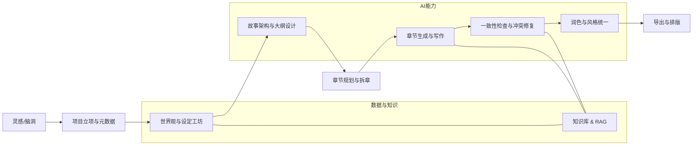

下面是我帮你整理的一套「系统化参考资料地图」，你可以直接对照现在自己的小说工作室，查缺补漏、挑模块落地。
---
## 一、先给一个总览：小说工作室可以长什么样
下面这张是「长篇小说 AI 工作室」的典型模块和流程，综合了 DOME 论文、AI_NovelGenerator、91Writing、Webnovel Writer 等项目的做法。

你可以把自己的项目对上去：哪些模块已经有了，哪些是空的，就可以按图补课。
---
## 二、整体流程与写作方法论：从“写一段”变成“写一本”
### 1. 常见长篇创作流程（可做成可配工作流）
综合各类小说软件和理论，一个比较完整的长篇流程是：
1. 灵感捕捉（一句话梗概、脑洞点子）
2. 项目立项：类型、题材、目标读者、字数、连载节奏
3. 世界观与设定：地理、历史、力量体系、社会结构等
4. 角色系统：主角/配角卡、性格、动机、关系网、弧光设计
5. 故事架构：三幕式 / 英雄之旅 / 雪花写作法等
6. 大纲与分卷：卷纲、章节目录、每章目标与冲突
7. 章节生成：AI 写初稿，人给约束与方向
8. 一致性审校：时间线、人设、设定冲突检测
9. 润色与风格：对话风格、场景节奏、文风统一
10. 导出与排版：TXT / DOCX / EPUB 等
这些都可以做成「步骤 + 可视化工作台」，类似 AI_NovelGenerator 的 GUI 流程。
### 2. 经典写作理论 → 可配置的“结构模板”
你可以在工作室里内置“结构模式”，让作者选一个就自动配好大纲骨架：
- **三幕式结构（Three-Act Structure）**：开端—对抗—解决，每幕的功能、转折点、高潮都有明确说法。
- **英雄之旅（Hero's Journey）**：12 步普通世界→冒险→回归，适合玄幻、冒险、成长类。
- **雪花写作法（Snowflake Method）**：从一句话 → 一段 → 角色卡 → 三幕大纲 → 场景列表，逐步细化。
这些都可以做成：  
「选择结构模板 → 自动生成章节骨架 + AI 填充细节」。
---
## 三、核心模块拆解：对照你现在项目查缺补漏
### 1. 项目 & 章节管理（“写一本”而不是“写一段”）
参考：novelWriter、bibisco、91Writing、AI_NovelGenerator。
常见能力：
- 多项目管理：不同书/不同系列分开
- 小说元数据：标题、作者、类型、标签、简介、封面、连载状态
- 卷/章节结构：卷→章节→场景，支持拖拽排序
- 章节状态：草稿 / 已完成 / 已发布，进度条可视化
- 字数 & 目标：单章目标字数、全本目标、每日写作统计
- 版本 & 快照：章节版本、自动保存、回滚
技术建议：
- 前端：项目树 + 章节列表 + 编辑器三栏布局（参考 novelWriter、91Writing）
- 后端：项目 / 章节 / 场景 为聚合根，存储用关系型或文档库均可
### 2. 世界观 & 设定工坊（设定库 + 卡片 + 模板）
参考：Notebook.ai、LegendKeeper、91Writing 世界观模块、AI_NovelGenerator“小说设定工坊”。
核心能力：
- 实体类型：角色、地点、组织、物品、种族、职业、魔法/科技体系等
- 卡片字段：自定义字段（外观、性格、背景、能力、关系、标签）
- 模板：按题材预制模板（修仙、赛博朋克、克苏鲁等）
- 关系：角色间关系、角色-地点/组织关系，可视化图谱
- 时间线：历史事件、主线时间线、角色个人时间线
- 一致性：自动检测设定冲突（年龄前后矛盾、设定被打破等）
实现建议：
- 数据模型：`Entity {id, type, name, attrs, relations[], project_id}`
- 关系存储：图数据库（Neo4j / 存图关系）或简单关系表
- UI：卡片列表 + 详情侧边栏 + 关系图可视化
### 3. 角色系统 & 角色弧光
参考：bibisco 强调“对角色了如指掌”、AI_NovelGenerator 的角色动力学设定、91Writing 角色卡。
模块点：
- 角色卡：基础信息、性格、动机、恐惧、成长弧光
- 角色弧光：开始状态→关键转变→最终状态，可视化曲线
- 关系网：亲情/友情/爱情/敌对/组织关系，带权重
- 角色状态追踪：随章节更新角色属性、位置、心理状态
- OOC 检测：行为与角色卡/弧光不符时预警
### 4. 大纲 & 章节规划（结构 + AI 导演）
参考：AI_NovelGenerator 的“设定→分卷大纲→章节目录→正文”流程、DOME 的动态分层大纲 DHO、StoryCraftr 的书结构管理。
关键点：
- 大纲层级：全书梗概 → 卷纲 → 章节目标 → 场景节拍
- 结构模板：三幕式 / 英雄之旅 / 雪花法，自动分配章节数量与节点
- AI 导演：从一句梗概自动生成多套“方向+卷纲+章节目录”，让作者选
- 断点续写：支持从任意章节继续，而不是只能从头跑
DOME 论文的 DHO（动态分层大纲）强调：先粗大纲保证完整性，再根据生成情况动态细化大纲，提高连贯性——这个思路可以直接做成你自己的“动态大纲”模块。
### 5. 记忆 & 一致性：RAG + 状态追踪
这是长篇最关键也最痛的地方，现有项目几乎都在这补课：
- **DOME**：时序知识图谱 + Memory-Enhancement Module，减少上下文冲突
- **AI_NovelGenerator**：向量数据库存角色状态 & 剧情片段，写前先检索 top-k 前文
- **Webnovel Writer**：混合检索（向量 + BM25 + 图关系）+ 实体关系图谱，专门解决“遗忘”和“幻觉”
- **91Writing**：世界观 + 一致性检查，减少低级穿帮
可以抽象为：
1. **知识库 / RAG 模块**
   - 向量库：Chroma / Qdrant / pgvector 等，存章节片段、设定、角色卡
   - 检索策略：按阶段（规划/写作/审校）动态构造上下文
   - 实体关系图谱：人物-地点-组织关系，防止“幻觉”
2. **状态追踪系统**
   - 角色状态：位置、能力、心理、受伤状态等随章节更新
   - 伏笔状态：埋设/回收状态，提醒别挖坑不填
   - 时间线：历史事件 + 章节时间点，检查时间冲突
3. **冲突检测**
   - 硬规则：年龄/设定/时间线矛盾
   - 软规则：OOC / 情节不合理（用 LLM 判断，参考 DOME 的 Temporal Conflict Analyzer）
### 6. AI 写作引擎：从“补全”升级到“生产链”
参考：AI_NovelGenerator 多阶段提示词链、StoryCraftr 的 CLI 工作流、Webnovel Writer 的规划/写作/审查三阶段 Agent、91Writing 的续写/润色/模板。
建议拆成几个子模块：
1. **续写 / 扩写**
   - 上下文：前 N 章 + 当前章节目标 + 世界观/角色卡检索
   - 参数：temperature / top_p / 长度 / 风格约束
   - 方向：续写方向（对话/动作/心理/环境）
2. **润色 & 改写**
   - 语法、文风、情绪、节奏四个维度（参考 Laper 对“真 AI”的定义）
   - 批量：对整章或选中片段做“风格统一”
3. **大纲 / 设定生成**
   - 从梗概生成世界观、角色卡、卷纲、章节目录（AI_NovelGenerator 已经这么做）
   - 支持多方案：生成 2–3 套方向让作者选
4. **审校 & 修复**
   - 一致性检查结果 → 自动修复建议 → 人确认
   - 常见问题：时间线冲突、设定穿帮、人物 OOC、节奏异常
5. **提示词库 / 写法模板**
   - 按题材：修仙、都市、悬疑、言情等不同模板
   - 按场景：对话、战斗、心理、环境、升级、转折等
   - 变量系统：角色名、设定名、前文摘要动态替换
### 7. 写作助手 & 界面体验
参考：WritingTools（系统级语法助手）、Obsidian TextGenerator 插件（模板 + 知识库生成）。
可以做的功能：
- 侧边栏 AI 助手：选中一段文 → 续写 / 润色 / 提纲 / 分析
- 模板调用：从提示词库选模板，一键生成大纲/章节/场景
- 知识库检索：写作时自动/手动查设定，不用离开编辑器
- 统计：字数、耗时、平均段落长度、对话占比等
---
## 四、具体开源项目 / 代码参考：你可以直接拆来用
### 1. 通用小说写作软件（偏传统，但结构可借鉴）
| 项目 | 语言/技术 | 特点 | 适合参考什么 |
|------|-----------|------|--------------|
| novelWriter | Python + Qt6 | 纯文本小说编辑器，Markdown+元数据，多文档组织 | 项目结构、文件组织方式、章节/场景管理 |
| bibisco | JavaScript (Electron) | 人物与章节管理，导出 PDF/DOCX，强调角色复杂度 | 角色卡设计、章节结构、导出逻辑 |
| Notebook.ai | Web (SaaS) | 世界构建工具：角色/地点/物品/时间线，模板化 | 世界观模块设计、卡片字段、时间线 |
### 2. AI 长篇小说生成框架（强烈建议重点看）
| 项目 | 技术栈 | 特点 | 你能学什么 |
|------|--------|------|------------|
| AI_NovelGenerator（YILING0013 等） | Python + Tkinter + Chroma | 全流程 GUI：设定→分卷→目录→草稿→审校→改写；向量库记忆；多 LLM/Embedding 适配 | 整体架构、RAG 记忆、一致性检查、工作流 UI |
| StoryCraftr | Python CLI | AI+CLI 做书结构、世界观、章节大纲；多工具组成 AI Craftr 套件 | CLI 工作流、结构化生成、模块拆分方式 |
| Webnovel Writer | Python + Claude Code | RAG 上下文管理 + 多 Agent（规划/写作/审查）+ 实体图谱 + Dashboard | RAG 架构、Agent 分工、实体关系维护 |
| AI-Novel-Writing-Assistant | TypeScript（Node + Web） | “AI 导演式长篇生产系统”：自动导演开书、整本生产链、写法引擎 | Agent 工作流、自动导演、写法引擎抽象 |
| 91Writing | Vue 3 + Element Plus | 前端写作工作台：项目/章节/世界观/提示词库/续写润色 | 前端架构、项目管理 UI、提示词库设计 |
### 3. 通用写作 / AI 助手（做“助手层”时可参考）
| 项目 | 用途 | 可借鉴点 |
|------|------|----------|
| WritingTools | 系统级语法助手 | 全局快捷键、语法/风格检查、跨应用集成方式 |
| Obsidian TextGenerator 插件 | 在笔记里用 AI 生成内容 | 模板系统、知识库联动、变量替换 |
---
## 五、写作理论 & 提示词实战：把“方法”变成“可配规则”
### 1. 结构理论 → 内置“故事模式”
- **三幕式**：Act1 建置 → Act2 对抗 → Act3 解决，每幕转折点可以配成“必填节点”。
- **英雄之旅**：12 步（普通世界→冒险→回归），适合成长线明显的长篇。
- **雪花写作法**：1 句话 → 1 段 → 角色卡 → 三幕大纲 → 场景列表。
你可以做成：  
选择“结构模式” → 自动生成大纲骨架 + 章节目标 → AI 按骨架扩写。
### 2. 提示词框架（长篇专用）
结合 AI_NovelGenerator 的多阶段提示词和网文提示词实战文章，可以抽象一个通用模板：
```text
你是一位【类型】小说家，正在创作【篇幅】【题材】小说。
【世界观约束】
- 力量体系：...
- 社会结构：...
- 关键规则：...
【当前项目状态】
- 已写章节：X-Y
- 当前位置：卷/章/场景
- 主要角色状态：...
【本章节目标】
- 推进情节：...
- 揭示信息：...
- 角色变化：...
【写作风格】
- 视角：第一人称/第三人称
- 文风：细腻/轻快/沉重/幽默
- 禁忌：无XXX、不使用YYY套路
【输出要求】
- 字数：约N字
- 场景数：M个
- 必须包含：对话、动作、心理、环境描写各占适当比例
```
你可以在工作室里把这类模板做成「可配置表单 + 模板引擎」。
---
## 六、落地建议：怎么把这些东西塞进你现在的项目
1. **先补“骨架”：项目 & 章节管理**
   - 参考 novelWriter / 91Writing，先把“项目→卷→章节→场景”的树状结构做出来。
   - 加上章节状态、字数统计、版本保存，这是后续一切的基础。
2. **再做“设定库”：世界观 + 角色系统**
   - 参考 Notebook.ai / AI_NovelGenerator，做一个实体卡片 + 关系图。
   - 先支持角色、地点、组织三类，再慢慢扩展。
3. **然后上“记忆”：RAG + 一致性检查**
   - 先用 Chroma / Qdrant 做一个简单的向量库，存章节 + 设定。
   - 实现“写前检索 + 冲突检测”的最小可用版本，再逐步加图谱和复杂规则。
4. **最后打磨“AI 引擎”**
   - 先实现续写 + 润色两个最刚需的能力，再逐步加“大纲生成”“自动导演”“整本生产链”。
   - 提示词库可以先用 JSON/YAML 管理，后续再做可视化编辑器。
---
如果你愿意，可以简单介绍一下你现在工作室的技术栈（前端/后端/是否已有 RAG/用什么模型），我可以帮你把这些参考项目再具体映射成一份「模块清单 + 技术选型建议」。
